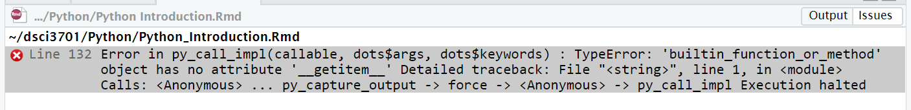

```{r setup, include=FALSE}
library(reticulate)
use_python("/home/dolanp/.virtualenvs/r-reticulate/bin/python",required=TRUE)
matplotlib<-import("matplotlib")
matplotlib$use("Agg",force=TRUE) #Enable the matplotlib rendering engine.
knitr::opts_chunk$set(echo = TRUE)
```

<!--Gratefully copied from https://matthewjamestaylor.com/blog/equal-height-columns-2-column.htm -->
<style>
.c2 {
	clear:left;
	float:left;
	width:100%;
	overflow:hidden;
	background:#ffa7a7; /* column 2 background colour */
}
.c1 {
	float:left;
	width:100%;
	position:relative;
	right:50%;
	background:#fff689; /* column 1 background colour */
}
.column-left {
	float:left;
	width:46%;
	position:relative;
	left:52%;
	overflow:hidden;
}
.column-right {
	float:left;
	width:46%;
	position:relative;
	left:56%;
	overflow:hidden;
}</style>

This document will be updated as the class progresses.  It contains a side-by-side comparison of R and Python

## White Space vs Braces
Languages whose pedigree extend back to C use braces:  `{` and `}` to indicate the start and stop of code blocks (languages descending from PASCAL tend to use `BEGIN` and `END`.)  Python does this with indentation.

----

## Defining Functions

Both R and Python allow functions with arguments that can be 

* Required
* specified by keyword
* specified by position
* have default values

<div class="c2"><div class="c1">
<div class="column-left">
### Defining Functions in R
In R functions are defined using the `function(<args>){<body>}` notation.  It produces a script that can be bound to any variable and executed using the `f(<args>)` construction:

```{r}
addOne=function(a,b){
  a+b+1
}
addOne(2,3)
```

In R **every** expression has a value... so functions can be used without being given a name (this is called **an anonymous function**)

```{R}
(function(a,b){a+b+1})(2,3)
```
The parenthesis are necessary.

The value of the function either comes from an explicit `return()` or it is the value of the last expression executed in the function.
</div>
<div class="column-right">
### Defining Functions in Python
In Python functions are **defined** and not, usually, assigned.  They **must** end in a `return` expression.  (In R, this is optional-- the value of the executed function is the last line executed in the function.)

```{python}
def addOne (a,b):
    return a+b+1

addOne(2,3)
```

Python also allows anonymous functions, but they use a different notation:

```{python}
addOne=lambda a,b: a+b+1
addOne(2,3)
```
</div></div></div>

---------

## Libraries

Both R and Python allow external code to be loaded in a variety of ways.  If we want to load a Python library **from R** we use `py_install("matplotlib")` (for example)
<!-- Consider adding examples -->
<div class="c2"><div class="c1">
<div class="column-left">
In **R**, external code can be loaded using:

* `source()`
* `load()`
* `library()`
* `require()`
</div>
<div class="column-right">
In **Python** (notebooks) we use

* `%run()`
* `import <library> AS <var>`
* `import <library>`
* `from <library> import <component>`
</div></div></div>

## Operations

Both languages understand the basic numeric operations (and they behave with the expected order of operations)

* `+`
* `-`
* `*`
* `\`

Both languages have similar comparisons:

* `<`, `<=`
* `>`, `>=`
* `==`, `!=`


Operation      |   R     |  Python   
---------------|---------|----------
Exponentiation | `^`     | `**`
Bound to same address | NA | `is` vs `is not`
integer devision| `floor (a/b)` | a//b
logical AND  | `&&` (note:  Only looks at first elt in a vector) | `&`
logical OR  | `||` (note:  Only looks at first elt in a vector) | `|`

### Special expressions
<div class="c2"><div class="c1">
<div class="column-left">
**R:**

* `NA`
* `NULL`
* `Inf`
* `NaN`
* `TRUE`
* `FALSE`
</div>
<div class="column-right">
**Python:**

* `True`
* `False`
* `math.inf`
* `None`
</div></div></div>
## Data Types

Here is a non-exhaustive collection of interesting data types:
<div class="c2"><div class="c1">
<div class="column-left">
**R:**

 * Scalar types
   * numeric (`integer` and `numeric`)
   * character
   * logical
   * complex ($a+bi$)
 * Array style
   * vectors
   * lists
   * data frame (list with class `data.frame` attribute)
   * matrix (vector with `dim` attribute)
  * Objects
   * Lots and lots... most come from packages
</div>
<div class="column-right">
**Python:**

 * Scalar types
    * numeric (`int` and `float`)
    * strings (triple quotes for multiline strings: ''' or """")
    * booleans
    * dates
    * times
    * complex numbers
  * Array style
    * list
    * tuple
  * Object style
    * dict
    * set
    * list
</div></div></div>
<!--Convert to strings

in R: as.character()
in Python str(var)
-->

### Strings

Both languages use *escaping*, single quotes, and double quotes.

Python has a **triple quote multi-line construction**.

```{python}
#Python
str = """ This string
can encompass multiple lines
so no need to use \\n"""
print(str)
```

In Python, converting a string to a list produces an array of the characters:

```{python}
#Python
list("Data Science")
```

### Concatenation
<div class="c2"><div class="c1">
<div class="column-left">
Concatenating in **R** is done with `paste0()`.

```{r}
#R
paste0("Peter"," ","Dolan")
```
</div>
<div class="column-right">
In **Python** the `+` operator works as concatenation on two strings:

```{python}
#Python
"Peter" + " " + "Dolan"
```
</div></div></div>

### Encoding
<div class="c2"><div class="c1">
<div class="column-left">
**R** has a myriad of internal representations for strings-- which can, to some extent, be detected and manipulating using the `Encoding` and `Encoding->` functions.  Please read [this article](https://kevinushey.github.io/blog/2018/02/21/string-encoding-and-r/) for a good overview of this information and a reminder about the intricacies of character encoding.
</div>
<div class="column-right">
**Python** on the other hand always uses unicode for its encoding.  It can convert strings easily between strings and lists (what we think of as arrays or vectors).  
</div></div></div>

### Substrings

Sustring functions work... but strings are immutable in Python-- you can't assign a subset of the string a new value and expect that the string will change.

operation   |        R        | Python
------------|-----------------|-----------
subset      | `substr()`      | str[<range>]

### String Lengths

Both languages have functions for returning the length of a string.:
<div class="c2"><div class="c1">
<div class="column-left">
**R:** Character vectors can be of length 1.  The `length()` function provides the number of elements in a vector or a list it does **NOT** express the number of characters.  In an entry.  You need to use `nchar()` for that.  NOTE:  `nchar()` **is** vectorized:

```{r}
#R
nchar(c("First String","Second String"))
```

</div>

<div class="column-right">
**Python:** The `len()` function serves a similar role in Python:
```{python}
#Python
len("First String")
```
</div></div></div>

### Special Python Constructions

Python has a language construction for raw strings that **turn off escaping**.  Just precede the quotes with the character `r` (or `R`):

```{python}
#Python
print(r"This is raw. \nNotice the missing newline")
print("This is not raw. \nNotice the newlines")
```

A similar construction uses a `b` before the quotes to produce a **binary string**:

```{python}
#Python
example=b'binary string'
example[0]
example[1]
example[2]
```
Notice these are the ASCII values (in decimal) for the corresponding characters.

<!--* `r""` construction in Python
* `b''` construction for raw bytes
 52 UTF vs ASCII and some encoding changing characters
FORMAT (pg 53 ish)-->

### Booleans

True/False values are built-in data-types in both languages.  Both languages have logical operators that are **short circuiting**.  For example, if two expressions are separated by $\textrm{AND}$, the second expression will **not** be evaluated if the first evaluates to `FALSE`.   

We will not prove it in this class, but any computer system that has negation $\textrm{NOT}$ and $\textrm{AND}$ can build **all** other logical operators.  For example:

$$
\textrm{OR}(x,y) = \textrm{NOT}\ \textrm{AND}(\textrm{NOT } x,\textrm{NOT }y)
$$
\
The upshot of this is that any langauge that implements both $\textrm{NOT}$ and $\textrm{AND}$ is, in an important sense, logically complete.

<div class="c2"><div class="c1">
<div class="column-left">
In **R** booleans are known as logicals.  
\

**Logical Values in R:**

| Value   |  Symbol      
|---------|--------------
| TRUE    | `TRUE` or `T`
| FALSE   |`FALSE` or `F`
|Missing  | `NA`         


**Boolean operations:**  

The basic logical operations of $\textrm{AND}$ and $\textrm{OR}$ have special symbols, the operations like $\textrm{XOR}$ require function calls:

Operator   |  Symbol  | Notes
-----------|----------|-------
not        | `!`      | Negates the truth value
and        | `&`      | Element-wise $\textrm{AND}$
and        | `&&`     | Short-circuiting $\textrm{AND}$-- only looks at first elt in a vector
or        | `!`      | Element-wise $\textrm{OR}$
or        | `!!`     | Short-circuiting $\textrm{OR}$-- only looks at first elt in a vector
xor       |`xor(x,y)` | Exlusive or-- componentwise
logical test | `is.logical(x)` | Tests if `x` is a logical vector
truth test|`isTRUE(x)`| If `x` is a logical with the value of TRUE the result is `TRUE`.  Otherwise the result is `FALSE`.  **ONLY** tests the first elt o f a vector
false test|`isFALSE(x)`| same as above but tests for `FALSE`
there exists|`any(x)`  | returns `TRUE` if ANY value in `x` is `TRUE`
for all | `all(x)`    | returns `TRUE` if **all** values in `c` are `TRUE` (respects logical conventions and returns `TRUE` if `x` is empty vector)

**Truth Tables:**  

```{r,echo=FALSE}
x<-c(NA,FALSE,TRUE)
names(x)<-as.character(x)
cat("And Table:\n")
outer(x,x,"&") # AND
cat("Or Table:\n")
outer(x,x,"|") # OR
cat("XOR Table:\n")
outer(x,x,xor)
```
\
\
\
\
\
**Type Conversion:**

Values are converted to logical using `as.logical()`.  

|data type            |   value(s)                
|---------------------|---------------------------
| numeric or integer  | $n \mapsto \begin{cases}\textrm{FALSE} & n=0\\\textrm{TRUE}&n \not= 0\end{cases}$ 
| character           | $c \mapsto \begin{cases}\textrm{FALSE} & c=\textrm{FALSE, False, false, F}\\\textrm{TRUE}&c=\textrm{TRUE, True, true, T}\\\textrm{NA}&c=\textrm{anything else}\end{cases}$ 
| factor              | Uses `levels` to determine value  

</div>
<div class="column-right">
In **Python** booleans are known as `Boolean`.  They are **constant objects**.  There is no *missing* logical value in Python.

**Logical Values in Python:**

| Value   |  Symbol      
|---------|--------------
| TRUE    | `True`
| FALSE   |`False` 
| Missing | None (`sort` of)

**Boolean operations:**  

The basic logical operations of $\textrm{AND}$ and $\textrm{OR}$ have speical symbols, the operations like $\textrm{XOR}$ require function calls:

Operator   |  Symbol  | Notes
-----------|----------|-------
not        | `not`      | Negates the truth value
and        | `and`      | Element-wise $\textrm{AND}$ (on lists)  Short circuits.
or        | `or`      | Element-wise $\textrm{OR}$ (on lists). Short circuits.
xor       |`^` | Bitwise exclusive-or (see below)
there exists|`any(x)`  | returns `TRUE` if ANY value in `x` is `TRUE`
for all | `all(x)`    | returns `TRUE` if **all** values in `c` are `TRUE` (respects logical conventions and returns `TRUE` if `x` is empty vector)

**BITWISE operators:**

To understand logical $\textrm{XOR}$ you need to understand what follows.  Python has **bitwise** logical operators-- these act on a bit-by-bit basis.  Python has the following maps:

$$
\textrm{False} \mapsto 0 \\
\textrm{True} \mapsto 1
$$
Thus bitwise operators work similarly to their boolean counterparts.  When Python uses bitwise operators on booleans, it first converts them to a numeric value, applies the operation and then **converts back**.  This means that the following bitwise operators will work as expected for built-in boolean values:

name           | symbol
---------------|-----------
$\textrm{AND}$ | `&`
$\textrm{OR}$  |`|` 
$\textrm{XOR}$ | `^` 

Please note, however, that these bitwise operators **do not short-circuit**.  Nor do they play nicely with Python lists.  This is in contrast to `and` and `or` in Python-- which do play nicely with lists and which do short-circuit.  **However** the Python object `None` does NOT convert to an integer and so it does **not** play nicely with these bitwise operators.

**Truth Tables:**  

```{python,echo=FALSE}
import numpy as np
import pandas as pd #NOTE:you may need to run py_install("pandas") before this works for you.
from itertools import product
from operator import xor

x=[None,False,True]
column_names=["None","False","True"] # I can use this construction in the repl: [str(p) for p in x]
row_names =  ["None","False","True"] # [str(p) for p in x]
andTable=np.reshape([(lambda x,y: x and y)(*p) for p in product(x,x)],(3,3))
df=pd.DataFrame(andTable,columns=column_names,index=row_names)
print("And Table:")
df
orTable=np.reshape([(lambda x,y: x or y)(*p) for p in product(x,x)],(3,3))
df=pd.DataFrame(orTable,columns=column_names,index=row_names)
print("Or Table:")
df
x=[False,True] #Can't use None in a bitwise ^

column_names=["False","True"]
row_names =  ["False","True"]

xorTable=np.reshape([(lambda x,y: x^y)(*p) for p in product(x,x)],(2,2))
df=pd.DataFrame(xorTable,columns=column_names,index=row_names)
print("XOR Table:")
df
```

**Type Conversion:**

Values are converted to logical using `bool()`.  

|data type            |   value(s)                
|---------------------|---------------------------
| numeric or integer  | $n \mapsto \begin{cases}\textrm{False} & n=0\\\textrm{True}&n \not= 0\end{cases}$ 
| character           | $c \mapsto \begin{cases}\textrm{False} & c=\textrm{""}\\\textrm{True}&c=\textrm{anything else}\end{cases}$ 
| `None`              | $\textrm{None}\mapsto\textrm{False}$
| Sequences or mappings  | $\textrm{obj} \mapsto\begin{cases}\textrm{False}& \textrm{sequence or mapping is empty}\\\textrm{True} &\textrm{otherwise}\end{cases}$

</div></div></div>
### Date/Time Types

In R we need to use the `Date()` object constructor (or something from the package `lubridate`).  In Python the datatime functions are part of the `datetime` package.

<!-- add more here-->
## Type casting

We have looked at this a little already. A few things to pay attention to:

* Python's `None` is most similar to `NULL` in R, **however** in some circumstances it behaves more like R's `NA`
* R has the `identical()` function for comparing if two variables are referring to the same memory location.  Python uses `is`

## Flow control

Python and R do code chunks differently.  In R the curly braces `{` and `}` denote the start and stop of a code block.  In Python, for many constructions, a colon ":" indicates the beginning of a code chunk, but the indention of the source code determines the code-block.  (Ask me if you have any questions about this).

R             |  Python
--------------|---------------
if/else       | if/elif/else
for(<var> in <sequence>)         | for <var> in <sequence>:
while(<cond>) | while <cond>:

### Ternary operator

Ternary means **three**.  This is an **operator** that expects three arguments:

* An expression that evaluates to a boolean
* An expression to evaluate if the boolean is $\textrm{TRUE}$
* An expression to evaluate if the boolean is $\textrm{FALSE}$

In **R:** we use the `ifelse()` function:

```
ifelse(condition,if-expr,else-expr)
```

In **Python:** we use the following language construction:

```
<value>=<true-expr> if <condition> else <false-expr>
```

### Simple Sequences

* in R: `a:b`
* in Python 2.x `range(a,b+1)` # NOTE:  In a 0-indexed language like python range(0,n) will iterate over ALL indices in a vector of length $n$.   
* in Python 3.x `list(range(a,b+1))`   
* in R: `seq(a,b,step=s)`
* in Python 2.x: `range(a,b+1,s)`
* in Python 3.x: `list(range(a,b+1,s))`

We do have to be careful however. In Python 2.x `range()` generates a **list**.  In Python 3.x it generates an **iterator**.  We can force the iterator to be a list using `list(range(a,b))`.  Iterators OFTEN act like a list-- but they are more memory efficient and NOT made in their entirety in advance.  Think about iterating over one million values:  `1:1000000`.  In R the for-loop `for (i in 1:1000000)` actually needs to produce a vector with one million entries... but in Python 2.x `for i in range(1000000)` a list of one million values is generated-- just like in R.  In Pyton 3.x such a list is **NOT** generated.  Instead, everytime the **next** element is requested the **iterator** knows to increase the value of `i` by 1 (and to stop at one million).

## Data Structures

### Tuples

A **tuple** is an **ordered** sequence of objects.  They allow nested structures and can contain objects of differing data types.

<div class="c2"><div class="c1">
<div class="column-left">
There is no exact analog in R.  The closest thing is a `list`, but the values **are** mutable:

```{r}
example1=list(3,4,'a')
example2=list(3,4,list('a',10),4)
example2[[3]] #Recall differences in [] vs [[]]
example1[[1]]
example1[[1]]=5
example1
```
Notice that in R the elements are shown using the notation for how they would be accessed.

**Concatenation:**

Concatenation in **R** uses the `c()` function:
```{R}
example=list(1,2,3,c('a','b','c'))
example2 = list(10,20,list('a',2),4)
c(example,example2)
```
</div>
<div class="column-right">
In **Python** tuples are a basic data-type.  They are non-modifiable (unumutable) sequences of Python **objects**.  

```{python}
example=3,4,'a'
example2=(3,4,('a',10),4)

example
example2
example2[2] # Remember Python is 0-based
```

Notice that Python expresses the **tuple** by surrounding it in parenthesis-- although that is not always necessary.  Tuples themselves are immutable, but they may contain mutable items which **can** be changed in place:

```{python}
example=(1,2,3,['a','b','c'])
example[3].append('d')
example[3][1]='NEW'
example
```

**Concatenation:**

Tuples can be concatenated using `+` in Python. 

```{python}
example1=(1,2,3,['a','b','c'])
example2 = (10,20,('a',2),4)
example1+example2
```
</div></div></div>

### Unpacking

Unlike R, Python allows tuples to be used to perform multiple variable assignments in a single, simple equation.

For example
```{python}
tup=(48,'Peter','Dolan')
(age,first,last)=tup
first+" " + last
```
That Python expression assigned 48 to `age`, 'Peter' to `first` and 'Dolan' to `last`.

R does not do this... but R does something a *bit* similar with vectors (see below for a refresh):

```{r}
example=1:10
example[2:3]=c(-2,-3)
example
```

So here the 2 element subset of `example` is replaced with the 2 element array `c(-2,-3)`.

Remember that R uses **recycling**:
```{r}
example=1:10
example[2:3]=-2
example
```

## Arrays

Arrays are **mutable** objects.  Typically they are indexed numerically.  Some languages (such as R) start with 1.  Other languages such as Python (and Javascript) start at 0.  In most languages an object is not an array unless all the entries are of the same data-type.  However, in a language where all values are objects, an array of objects can contain elements of quite different classes.

<div class="c2"><div class="c1">
<div class="column-left">
In **R** arrays are 1-based.  In Python they are 0-based.  This means that in R `array[1]` is the **first** element and in Python `array[0]` is the **first** element.  In R, the datatype for an array is called a `vector`.  All elements must be of the same data type.  R will automatically convert elements (when it can) to be of an appropriate type when added (or modified) to an existing vector.  R also has a `list` data type-- which is similar to an vector but does not place any restrictions upon the data-types of the entries.

**Making arrays:**

In R we generate arrays in many ways (`seq()`, `start:stop`, *output of functions*) but the most common way not involving interactive (or file) input is with `c()`. The `[` and `]` characters are used to create new arrays from the old-- either subsets or,sometimes, longer arrays built out of repeated subarrays:

```{r}
array=c(10,20,19,48,27,13)
array[2]
array[-1]
array[2:3]
array[c(2,2,1,1,2:4,4:2)]
```

Note that `c()`, in contrast to `list()`, **flattens**:

```{r}
c(1:3,3:1)    # A vector with 6 elements
list(1:3,3:1) # A list with 2 elements
```

In R the single `[` and `]` retain the data type of the object in question... so when applied to vectors, the result is a vector (note a vector of length 1 is still vector).  When applied to R lists it produces lists.  Also note, that in R a vector is always of the same data type.

**Inserting an element:**

There's no particularly "nice" way to do this in R:

```{r}
array=c(10,20,19,48,27,13)
array=c(array[1:3],'-1',array[4:6]) #Insert -1 at location 4
array
```

**Removing an element:**

Again, in R, there's no particularly nice way to do this:

```{r}
array=c(10,20,19,48,27,13)
array=c(array[1:3],array[5:6]) #Remove entry at location 4
```

**Appending to end of array:**  

R uses `c(old.list,<new elt>)`

**More about removing:**

In R (at least in base R) we build a new array that does no longer has the "offending" elements:

```{r}
example=c(1:10,5:7)
example=example[example!=2]
example
example=example[example!=6]
```

**Concatenating arrays:**
In R one would use `c()`:

```{r}
base=c(1:10,5:7,0)
newEnding=c(10,20,c(5,1),3) # In R, for vectors, nesting will not be kept and the array is flattened
newEnding
base=c(base,newEnding)
base

base=list(1,2,3,4,5,6,7,8,9,10,5,6,7,0) # Now do it as along list
newEnding=list(10,20,list(5,1),3)
newEnding
base=c(base,newEnding) #new list formed by concatenating the two old ones
base
```

</div>
<div class="column-right">
In Python the closest data type is called a `list` (which means we need to be **very careful** to distinguish between a list in R and a list in Python).  In Python the data type of elements in a list need not be the same so both Python and R use `list` to refer to sequences that can contain different types of elements.  Lists in Python are mutable-- so their contents can be changed in place.

In Python lists and tuples can often be used interchangeably.  Although one is mutable and the other is not.

**Making arrays:**

In Python, the `[` and `]` are used in a similar fashion to indexing in R, but the symbols are **also** used in place of `c()`:

```{python}
array=[10,20,19,48,27,13]
array[2]
array[-1]
array[2:3]
# array[c(2,2,1,1,2:4,4:2)]
```

In Python `array=10,20,19,48,27,13` is syntactically correct, but it generates a *tuple* and **not** a *list*.

**Inserting an element:**

Python has an `insert()` method

```{python}
array=[10,20,19,48,27,13]
array.insert(3,-1) #Insert -1 at location 4
array
```

**Removing an element:**  

To remove an element in Python use `pop()`
```{python}
array=[10,20,19,48,27,13]
array.pop(4)
array
```

**Appending to end of array:**

Python explicitly has an `.append()` method to add a value to the end of an Python list.  In Python `append()` is much more efficient than `.insert()`

**More about removing:**

Python has the `.remove()` method which allows a list element (or elements) to be removed based upon value instead of index:

```{python,eval=FALSE}
example=list(range(1,11))+list(range(5,8))
example.remove(2)
example
example.remove(6)
example
```

**Concatenating arrays:**

In Python one can use the `+` operator on two lists or the `.extend()` method:

```{python}
base=list(range(1,11))+list(range(5,8))+[0]
newEnding=[10,20,(5,1),3] 
newEnding # nested structures will be kept in Python
base+newEnding
base.extend(newEnding)
base
```
</div></div></div>

## Advanced sorting

Python's list type allows for objects.  The `.sort()` method can be given a **comparator function** that allows two elements to be compared in a sophisticated fashion.  Consider a list of two-element lists.... perhaps each elt in the array is a name and an age:

In Python:
```{python}
twoLayered=[["Peter",48],["Heather",35],["Amy",40],["Zet",9]]
```

We would really like to sort the elements based off the second entry.  The `key=function` keyword argument in `sorting()` allows this to happen in an easy to read fashion (make sure you review the anonymous function `lambda` construction)

```{python}
twoLayered.sort(key=lambda x:x[1])
twoLayered
```
If you find anonymous functions confusing then it is fine to use the `def` construction:

```{python}
def secondElt (x):
    return x[1]
   
twoLayered=[["Peter",48],["Heather",35],["Amy",40],["Zet",9]]
twoLayered.sort(key=secondElt)
twoLayered
```

### Indexing (aka splicing)

Feature                   |R                           |       Python
--------------------------|----------------------------|--------------------
Postive Numeric index (i) |1-based  (ith elt in array) | 0-based ((i+1)-th elt in array)
Negative Numeric Index(-i)| removed array[i]           | reference from END of array (end is -1)
seq (a:b)                 | indices a <= i <= b        | indices a<= i < b


###Sorting arrays

Python has a `.sort()` method which sorts a list in place (but not a tuple):

```{python}
example=[10,20,5,1,3] 
example.sort()
example
```

Note, that Python 2.x is fine sorting a list with integers and tuples, but Python 3.x is not.  The following would work in Python 2.x but fails in Python 3.x:

```{python,eval=FALSE}
example=list(10,20,list(5,1),3)
sort(example)
```

In R we use `sort()`, but only on vectors:

```{r}
example=c(10,20,5,1,3)
sort(example)
```

The following would generate an error in R if wwas attempted:

```{r,eval=FALSE}
example=list(10,20,5,1,3)
sort(example)
```

But, because of flattening, this does work:

```{r}
example=c(10,20,c(5,1),3)
sort(example)
```

## Associative arrays

Consider the following table:

Name    | age
--------|------
Peter   | 48
Heather | 35
Amy     | 40 
Zet     | 11

We can determine that Amy's age is 40 by *looking up Amy*

This is the essence of an associative array.  In R we build a list (or vector) with **named values** or we add a `names()` attribute:

```{r}
age.lookup<-c(Peter=48,Heather=35,Amy=40,Zet=11) # Method 1
age.lookup["Peter"]
age.lookup=c(48,35,40,11) # Method 2
names(age.lookup)=c("Peter","Heather","Amy","Zet")
age.lookup["Peter"]
```

In Python we use a **dict** data-type.  The syntax is very similar to JSON:

```{python}
ageLookup={'Peter': 48, 'Heather': 35, 'Amy': 40, 'Zet': 11}
ageLookup["Peter"]
```

<!--IMMUTABLE DISCUSSION
sorted()-->
 
## SETS

There is no analog in R, although there are set-based operations.  Without knowing the **universe** the **complement** operation can't be performed, but if there is a universal set of some sort (call it U) then the `setdiff` function can generate the complement.

* `unique()`
* `setdiff(A,B)`
* `union(A,B)`
* `intersect(A,B)`

## Reference vs Value

Even if you are a computer science person you might not think about the meaning behind expressions such as:

* `a<-3` in R
* `a=3` in Python

On some level the interpretor has to decide what the `3` is, how to represent it as a bit pattern, and how to **bind** the variable `a` to the corresponding bit pattern.

Now consider two variables `a` and `b`.  Assume `a` containst he value 3.  Consider the following:

* `b<-a` (in R)
* `b=a` (in Python)

Are these doing the same thing?  Surprisingly the answer is sometimes NO!

In R the **assignment** operator will make a **copy** of the bit pattern somewhere else in RAM and bind the symbol `a` to that value.  Python does the same thing for **primitive data types**.  

However, for objects:

* R copies the value of objects
* Python makes references to objects

In other words, for objects, the **assignment** operator in Python will bind the symbol `a` **to the same memory location** as `b`.

Let's see what this means in R:

```{r}
a<-c(3,4)
b<-a
a[1]=2 #first element of a is changed to 2
b
```

And now in Python:

```{python}
a=[3,4]
b=a
a[0]=2 #first element of a is changed to 2
b
```

Notice that in R the value of the variable `b` remains unchanged.   In Python the value of the variable `b` has changed.  

Reread what I wrote above and pay special attention to the word **bind**.  Ultimately all variables are **bound** to a physical memory address somewhere in the computer.  If multiple expressions, ultimately, refer to the same region of memory then any change to that region of memory will influence **all** those expressions with the same reference.

When dealing with large datasets it is much more efficient to use Python's approach.  However, it is much easier for unforeseen side-effects to take place.  The two approaches require the programer to pay attention to detail in different ways.

```{r}
(a<-c(1,2,3))
append=function(x,n){
  x<-c(x,n)
}
append(a,-10)
a
```

```{python}
a=[1,2,3]
a
def append(x,n):
    x=x.append(n)
    return(x)

append(a,-10)
a
```

### Dynamic References

IN both R and Python there is no need to define the **data type** of a variable-- it is handled automatically and changes as necessary:

R:
```{r}
a=3
typeof(a)
a="3"
typeof(a)
```

Python:
```{python}
a=3
type(a)
a="3"
type(a)
```

**Type conversion** is looser in R than it is in Python.

R:
```{r}
a=c(3)
c(a,"4")
```

Python (this is not executed because it would generate an error):
```{python,eval=FALSE}
a=[3]
a.append["4"]
```


### Attributes

Both R and Python allow attributes to be associated to a variable.  But in very different ways.  

In Python, an attribute is a function associated to an object (you may have seen this terminology and behavior in other langauges).  Typically in an object is created using a syntax that we'll discuss later, and the member variable is accessed using the `obj.attr` notation.  We won't go too deeply int that just quite yet.

On the other hand, in R, attributes are, typically, meta-data associated to a variable.  They can be added or removed as desired.

Python has a particularly nice `docstring` (stored as the `__doc__` attribute) that makes it easy to document a function.  Here's an example:

```{python}
def myFunction(x):
    """
    Does not really do anything... just here for example
    
    Returns
    ---------
    the_value: type of arguments
    """
    return x
    
myFunction(3)
print(myFunction.__doc__)
```

R uses the `attr(obj,"attr")` expression which can be used both to *get* the value of the attribute and to *set* it:

```{r}
my.sequence=1:10
attr(my.sequence,"note")="DSci Example"
attr(my.sequence,"note")
```

Setting an attribut to `NULL` removes it from the variable.

## A Python example:

```{python}
import matplotlib.pyplot as plt
def looper ( n ):
  "This calculates the 3n+1 loop"
  n=int(n)  
  if n < 0:
    raise ValueError('n should be greater than 0')
  loop = [n]
  while (n!=1):
    if (n%2==0):
      n=int(n/2) #ensure it remains an integer
    else:
      n=3*n+1
    loop.append(n)
  return(loop)
looper(3)
results=list(map(lambda n: len(looper(n)),list(range(1,1000))))
plt.plot(range(1,1000),results,'ro')
```


<!--https://docs.microsoft.com/en-us/azure/devops/pipelines/create-first-pipeline?view=azure-devops&tabs=tfs-2018-2-->