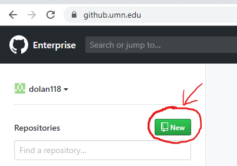
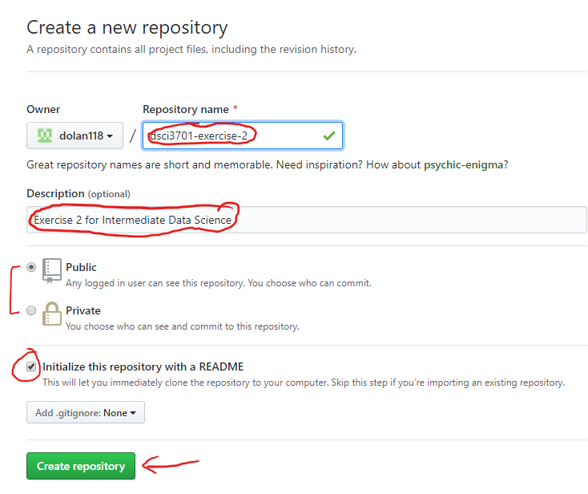
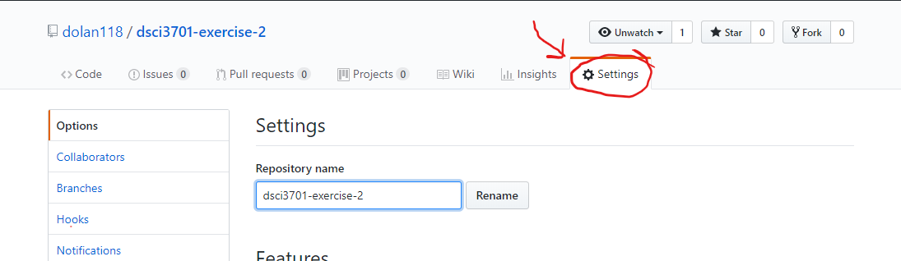
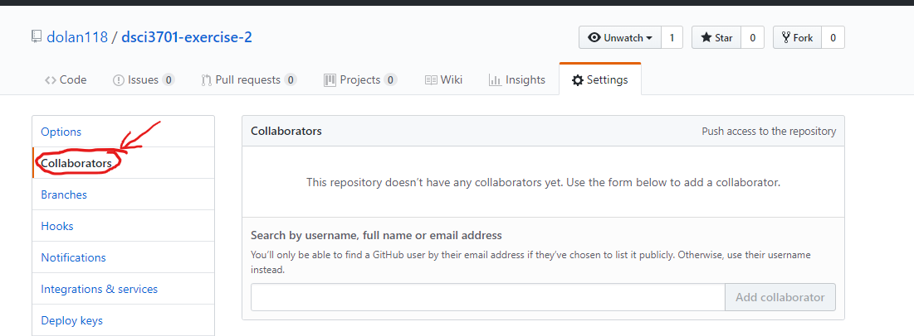
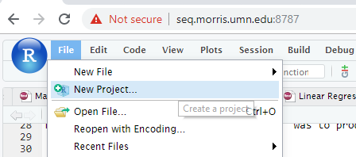
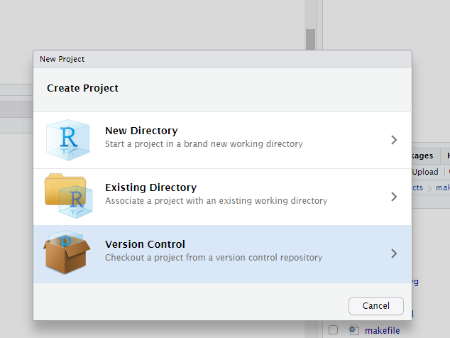
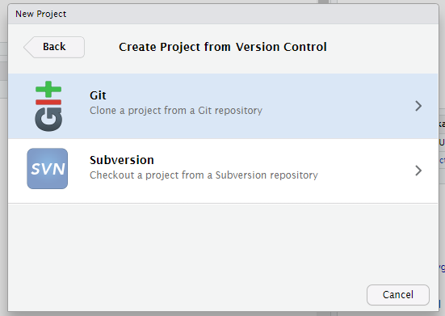
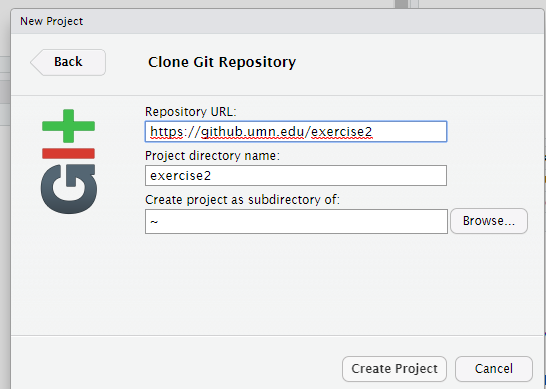
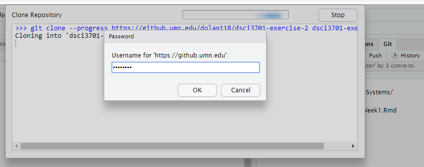
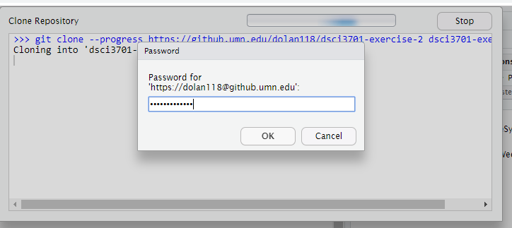

```{r setup, include=FALSE}
knitr::opts_chunk$set(echo = TRUE)
library(reticulate)
matplotlib<-import("matplotlib")
matplotlib$use("Agg",force=TRUE) #Enable the matplotlib rendering engine.
```

## Week Two

The program `git` is an example of **version control** software.  It is very useful for storing coding projects, or any project that will have multiple people interacting with the contents.  It is both a convenient way to make the project **available** to a larger audience and to allow multiple people to work on the same document at the same time.

The files and data is stored in a **repository**.  Several public repository collections are available.  The most popular is `www.github.com`.  Our university system has a local repository hub at `github.umn.edu`.  The contents of a public repository can be viewed in a web browser via a web address.  For example, you can see an example of one of my projects at `https://github.com/dolan-peter/dtou`.  Many repositories have a `README.md` file which uses **markdown** (similar to RMarkdown).

We will start by sharpening our skills with the command line.  First, ensure that the `stargazer` package is installed in R.  Then open a terminal (if one isn't already active) on `umm-rstudio2.morris.umn.edu` and do the following:

```{bash,eval=FALSE}
mkdir project
cd project
git clone https://github.com/leeper/make-example
cd make-example
make 
```

Notice that the result of running `make` was to produce a file called `paper.pdf`.


Your linux command list now includes
```
pwd
ls
cd
mkdir
git
make
```

Let's make a new github project on our university account

### New Repository

1. Go to `https://github.umn.edu`
2. Log in
3. Create new repository 

4. Enter the Details:   


### Adding Collaborators

To add a collaborator to your **github** project.
1. Go to Settings   

2. Select Collaborators   

3.  Use the X.500 ID of your fellow university colleague (student or faculty or admin).  THey must already have logged into `github.un.edu` at least once for their name to appear
4. Click `Add collaborator`

### New R Project (backed by git)

1. Create a new project   
   


2. Make it a Version Control Project   


3. Select Git   


4. Enter the details about the github repository:   

5. Enter your username (if asked)   


6. Enter your username (if asked)   


## Using git

Now you are good to do.  There should be a `git` tab.  Anytime you make a relatively major change, 

* **Stage** your changes
* **Push** your changes

Anybody else can make a github project bound to the same repository.

After any major changes from somebody else **Pull** your changes.

## Command Line git

In the terminal change to the diretory with the git files.

You need to use `git add` to add **changes** to your repository (such as a new file).  For example, all changes to text files in the current directory could be a added as follows:

```
git add *.txt
```

Notice the use of `*` as a wild-card character.  This is common in command line interfaces-- most shells understand it and so does window's `cmd` and `powershell` utilities.  The asterisk stands for *zero or more characters*.  This should **not** be confused with the use of `*` in most regular expression implementations.  

It is common to use

```
git add .
```

Which will add all the changes to files in the current working directory (but **not** in subdiretories).  To add all changes use

```
git add --all
```

You can then use `git commit` to commit the changes to your repository.  Using `git commit` will bring up a (by default) a vim window.


and `git push` to update the central repository (the one on `github.umn.edu`)

The commands `git add` 

## File Manipulation

Recall that `ls` lists files.  You can see the contents of the file using

* `cat`
* `less`

A file can be moved using `mv` and removed using `rm`.  (I'll demonstrate some examples in class)

## Piping

Everything in Unix is a **file**.  Some special "files" exist to deal with interactions.

* Standard in `stdin`
* Standard out `stdout`
* Standard error `stderr`

The redirections symbols:

<file> `<` <cmd> [replaces `stdin` with <file>]

<cmd> `>` <file> [replaces `stdout` with <file> (overwrites <file>)]

<cmd> `>>` <file> [replaces `stdout` with <file>, (**appends** to end of <file>)]

<cmd1> `|` <cmd2> [uses `stdout` of <cmd1> as `stdin` of <cmd2>]

<cmd> `2>` <file> [replaces `stderr` with <file> (overwrites <file>)]

<cmd> `2>>` <file> [replaces `stderr` with <file>, (**appends** to end of <file>)]

```{bash,eval=FALSE}
ls -l | grep "drwx"`
find /home -name "*exercise-2*"
find /home -name "*exercise-2*"> found
cat found
find /home -name "*exercise-2*" 2> err
cat err
```

The UNIX philosophy is to use lots of little commands and chain them together.

(Discuss `egrep` and regular expressions.)

## Editing a file

I like using `vim`.  Because you can find it, or its earlier incarnation `vi` on just about every system.

Show `vimtutor`.

Vim is a **modal** editor.  Examples are
* Normal Mode (you start in this mode)
* Insert Mode (for inserting text)
* Visual Mode (useful for selecting blocks of text)

In Normal mode you can
* Navigate
* Delete characters, words, or lines
* Enter commands using the `:cmd` syntax

### Super fast most important stuff

Hit `<esc>` to get to normal mode (if you're not there already)

```
:q              quits
:w              writes (saves file)
:x              writes and saves
:color elflord  change to color scheme elflord (there are 100s of colors schemes)
```

:q! quits **without** saving (sometimes this is very important)

Simple navigation:

Basic navigation is done with the keys `hjkl` (**while in normal mode**)

```
h left
j up
k down
l right
```
You can also use regular expression characters (**while in normal mode**)

```
^ start of line
$ end of line
```

To switch to inserting mode use `i` at the current cursor location
Use `I` to switch to insert mode at the start of the line
Similarly `a` starts appending ONE character after the cursor and
`A` inserts at the end of the line.

**I will add more**

