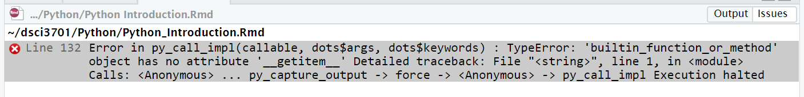

```{r setup, include=FALSE}
knitr::opts_chunk$set(echo = TRUE)
```

## Introduction to Python

Much like R, Python is a scripting language that is available for free.  It is very popular and has thousands of packages.  The language is particularly popular for machine learning and we will use `Anaconda` to download all the relevant packages.

### Installing Anaconda
### Juptyter Hub
### Accessing your Jupyter Hub account on my server
seq.morris.umn.edu:8888
First time you use the service the password you use will become your new password

Both R and Python can use positional **and** keyword arguments

NOTE:  look into using `doctest`

### White Space vs braces
Languages whose pedigree extend back to C use braces:  `{` and `}` to indicate the start and stop of code blocks (languages descending from PASCAL tend to use `BEGIN` and `END`.)  Python does this with indentation.

## Defining Functions

In R functions are defined using the `function(<args>){<body>}` notation.  It produces a sript that can be bound to any variable and executed using the `f(<args>)` construction:

```{r}
addOne=function(a,b){a+b+1}
addOne(2,3)
```

In R **every** expression has a value... so functions can be used without assignment them to names fairly easily (this is called **an anonymous function**)

```{R}
(function(a,b){a+b+1})(2,3)
```
THe parenthesis are necessary.

In Python functions are **defined** and not, usually, assigned.  They **must** end in a `return` expression.  (In R, this is optional-- the value of the executed function is the last line executed in the function.)

```{python}
def addOne (a,b):
    return a+b+1

addOne(2,3)
```

Python also allows anonymous functions, but they use a different notation:

```{python}
addOne=lambda a,b: a+b+1
addOne(2,3)
```

## TYpes of arguments

Both R and Python allow functions with arguments that can be 

* Required
* specified by keyword
* specified by position
* have default values

ADDTHIS

## Libraries

In R, external code can be loaded using

* `source()`
* `load()`
* `library()`
* `require()`

In Python (noteooks) we use

* `%run()`
* `import <library> AS <var>`
* `import <library>`
* `from <library> import <componenets>

## Operations

Both languages understand the basic numeric operations (and they behave with the expected order of operations)

* `+`
* `-`
* `*`
* `\`

Both languages have similar comparisons:

* `<`, `<=`
* `>`, `>=`
* `==`, `!=`


Operation      |   R     |  Python   
---------------|---------|----------
Exponentiation | `^`     | `**`
Bound to same address | NA | `is` vs `is not`
integer devision| `floor (a/b)` | a//b
logical AND  | `&&` (note:  Only looks at first elt in a vector) | `&`
logical OR  | `||` (note:  Only looks at first elt in a vector) | `|`

### Special expressions

R:

* `NA`
* `NULL`
* `Inf`
* `NaN`
* `TRUE`
* `FALSE`

Python:

* `none`
* `True`
* `False`

## Data Types

Python:
 * Scalar types
    * numeric (`int` and `float`)
    * strings (triple quotes for multiline striangs: ''' or """")
    * booleans
    * dates
    * times

Convert to strings

in R: as.character()
in Python str(var)

### Strings

Both languages use *escaping*, single quotes, and double quotes.

Python has a triple quote multi-line construction.

In Python, converting a string to a list produces an array of the characters:

```{python}
list("Data Science")
```

Concatenating in R is done with `paste0()`.  In Python the `+` operator works as concatenation on two strings:

```{python}
"Peter" + " " + "Dolan"
```

R has a myriad of internal representations for strings-- which can, to some extent, be detected and manipulating using the `Encoding` and `Encoding->` functions.  Please read https://kevinushey.github.io/blog/2018/02/21/string-encoding-and-r/ for a good overview of this information and a reminder about the intricacies of character encoding.

Python on the other hand always uses unicode for its encoding.  It can convert strings easily between strings and lists (what we think of as arrays or vectors).  Subsetting functions work... but strings are immutable in Python-- you can't assign a subset of the string a new value and expect that the string will change.

operation   |        R        | Python
------------|-----------------|-----------
subset      | `substr()`      | str[<range>]

r"" construction in Python
b'' construction for raw bytes
Page 52 UTF vs ASCII and some encoding changing characters
FORMAT (pg 53 ish)

### Booleans

TRUE/FALSE vs True/False

### Date/Time Types

In R we need to use the `Date()` object constructor (or something from the package `lubridate`)

## Type casting

None vs NULL and need to use `is` none (compare to is.null(var) in R)
## Flow control

White space vs brackets

R             |  Python
--------------|---------------
if/else       | if/elif/else
for(<var> in <sequence>)         | for <var> in <sequence>:
while(<cond>) | while <cond>:

###Ternary operator
ifelse(a,if-expr,else-expr) in R
<value>=<true-expr> if <condition> else <false-expr>


### simple sequences

in R: a:b
in Python range(a,b+1) # NOTE:  In a 0-indexed language like python range(0,n) will iterate over ALL indices in a vector of length $n$.
in R: seq(a,b,step=s)
in Python: range(a,b+1,s)

## Data Structures

### Tuples

non-modifiable (unumutable) sequences of Python **objects**.  Conceptually similar to R's `list`. Both allow for nested structures and can contain objects of differing data types.

In Python:
```{python}
example=3,4,'a'
example2=(3,4,('a',10),4)

example2[2] # Remember Python is 0-based
```

Notice that Python expresses the **tuple** by surrounding it in parenthesis.

In R:
```{r}
example=list(3,4,'a')
example2=list(3,4,list('a',10),4)
example2[[3]] #Recall differences in [] vs [[]]
```

Notice that in R the elements are shown using the notation for how they would be accessed.

**EXERCISE**

Tuples themselves are immutable, but they may contain mutable items which **can** be changed in place:

in Python:
```{python}
example=(1,2,3,['a','b','c'])
example[3].append('d')
example[3][1]='NEW'
example
```

Tuples can be concatenated using `+` in Python.  In R you would use `c()` to concatenate two lists...

In Python:
```{python}
example=(1,2,3,['a','b','c'])
example2 = (10,20,('a',2),4)
example+example2
```

In R:
```{R}
example=list(1,2,3,c('a','b','c'))
example2 = list(10,20,list('a',2),4)
c(example,example2)
```
### Unpacking
Unlike R, Python allows tuples to be used to perform multiple variable assignments in a single, simple equation.

For example
```{python}
tup=(48,'Peter','Dolan')
(age,first,last)=tup
first+" " + last
```
That Python expression assigned 48 to `age`, 'Peter' to `first` and 'Dolan' to `last`.

R does not do this... but R does something a *bit* similar with vectors (see below for a refresh):

```{r}
example=1:10
example[2:3]=c(-2,-3)
example
```

So here the 2 element subset of `example` is replaced with the 2 element array `c(-2,-3)`.

Remember that R uses **recycling**:
```{r}
example=1:10
example[2:3]=-2
example
```

##Arrays (list and vectors)

In R arrays are 1-based.  In Python they are 0-based.  This means that in R `array[1]` is the **first** element and in Python `array[0]` is the **first** element.  In R, the datatype for an array is called a `vector`.  All elements must be fo the same data type.  R will automatically convert elements (when it can) to be of an appropriate type when added (or modified) to an existing vector.  

In Python the closest data type is called a `list` (which means we need to be **very careful** to distinguish between a list in R and a list in Python).  In Python the data type of elements in a list need not be the same so both Python and R use `list` to refer to sequences that can contain different types of elements.  Lists in Python are mutable-- so their contents can be changed in place.

In Python lists and tuples can often be used interchangeably

## Add exercise

In R we generate arrays in many ways (`seq()`, `start:stop`, *output of functions*) but the most common way not involving interactive (or file) input is with `c()`. The `[` and `]` characters are used to create new arrays from the old-- either subsets or,sometimes, longer arrays built out of repeated subarrays:

In R:
```{r}
array=c(10,20,19,48,27,13)
array[2]
array[-1]
array[2:3]
array[c(2,2,1,1,2:4,4:2)]
```

Note that `c()`, in contrast to `list()`, **flattens**:

```{r}
c(1:3,3:1)    # A vector with 6 elements
list(1:3,3:1) # A list with 2 elements
```

In R the single `[` and `]` retain the data type of the object in question... so when applied to vectors, the result is a vector (note a vector of length 1 is still vector).  When applied to R lists it produces lists.  Also note, that in R a vector is always of the same data type.

In Python, the `[` and `]` are used in a similar fashion but they are **also** used in place of `c()`.

```{python}
array=[10,20,19,48,27,13]
array[2]
array[-1]
array[2:3]
array[c(2,2,1,1,2:4,4:2)]

```

In Python `array=10,20,19,48,27,13` is syntactically correct, but it generates a *tuple* and **not** a *list*.

### Inserting an element

There's no particularly "nice" way to do this in R.

```{r}
array=c(10,20,19,48,27,13)
array=c(array[1:3],'-1',array[4:6]) #Insert -1 at location 4
array
```

Python has a an `insert()` method

```{python}
array=[10,20,19,48,27,13]
array.insert(3,-1) #Insert -1 at location 4
array
```

To remove an element in Python use `pop()`
```{python}
array=[10,20,19,48,27,13]
array.insert(3,-1) #Insert -1 at location 4
array
array.pop(4)
array
```

Again, in R, there's no particularly nice way to do this:

```{r}
array=c(10,20,19,48,27,13)
array=c(array[1:3],'-1',array[4:6]) #Insert -1 at location 4
array
array=c(array[1:3],array[5:7])
array
```

Python explicilty has an `.append()` method to add a value to the end of an Python list.  R uses `c(old.list,<new elt>)`

In Python `append()` is much more efficient than `.insert()`

### more about removing

Python has the `.remove()` method which allows a list element (or elements) to be removed based upon value instead of index:

```{python}
example=range(1,11)+range(5,8)
example.remove(2)
example
example.remove(6)
example
```

In R (at least in base R) we build a new array that does no longer has the "offending" elements:

```{r}
example=c(1:10,5:7)
example=example[example!=2]
example
example=example[example!=6]
```
## Advanced sorting

Python's list type allows for objects.  The `.sort()` method can be given a **comparator function** that allows two elements to be compared in a sophisticated fashion.  Consider a list of two-element lists.... perhaps each elt in the array is a name and an age:

In Python:
```{python}
twoLayered=[["Peter",48],["Heather",35],["Amy",40],["Zet",9]]
```

We would really like to sort the elements based off the second entry.  The `key=function` keyword argument in `sorting()` allows this to happen in an easy to read fashion (make sure you review the anonymous function `lambda` construction)

```{python}
twoLayered.sort(key=lambda x:x[1])
twoLayered
```
If you find anonymous functions confusing then it is fine to use the `def` construction:

```{python}
def secondElt (x):
    return x[1]
   
twoLayered=[["Peter",48],["Heather",35],["Amy",40],["Zet",9]]
twoLayered.sort(key=secondElt)
twoLayered
```

###Indexing (aka splicing)

Feature                   |R                           |       Python
--------------------------|----------------------------|--------------------
Postive Numeric index (i) |1-based  (ith elt in array) | 0-based ((i+1)-th elt in array)
Negative Numeric Index(-i)| removed array[i]           | reference from END of array (end is -1)
seq (a:b)                 | indices a <= i <= b        | indices a<= i < b

### Concatenating arrays

In Python one can use the `+` operator on two lists or the `.extend()` method:

```{python}
base=range(1,11)+range(5,8)+[0]
newEnding=[10,20,(5,1),3] 
newEnding # nested structures will be kept in Python
base+newEnding
base.extend(newEnding)
base
```

In R one would use `c()`:

```{R}
base=c(1:10,5:7,0)
newEnding=c(10,20,c(5,1),3) # In R, for vectors, nesting will not be kept and the array is flattened
newEnding
base=c(base.newEnding)
base

base=list(1,2,3,4,5,6,7,8,9,10,5,6,7,0) # Now do it as along list
newEnding=list(10,20,list(5,1),3)
newEnding
base=c(base,newEnding) #new list formed by concatenating the two old ones
base
```

###Sorting arrays

Python has a `.sort()` method which sorts a list in place (but not a tuple):

```{python}
example=[10,20,(5,1),3] 
example.sort()
example
```

in R use `sort()`

```{r}
example=list(10,20,list(5,3),3)
sort(example)
```
## Associative arrays

Consider the following table:

Name    | age
--------|------
Peter   | 48
Heather | 35
Amy     | 40 
Zet     | 11

We can determine that Amy's age is 40 by *looking up Amy*

This is the essence of an associative array.  In R we build a list (or vector) with **named values** or we add a `names()` attribute:

```{r}
age.lookup<-c(Peter=48,Heather=35,Amy=40,Zet=11) # Method 1
age.lookup["Peter"]
age.lookup=c(48,35,40,11) # Method 2
names(age.lookup)=c("Peter","Heather","Amy","Zet")
age.lookup["Peter"]
```

In Python we use a **dict** data-type.  The syntax is very similar to JSON:

```{python}
ageLookup={'Peter': 48, 'Heather': 35, 'Amy': 40, 'Zet': 11}
ageLookup["Peter"]
```

IMMUTABLE DISCUSSION
sorted()
 
## SETS


##Reference vs Value

Even if you are a computer science person you might not think about the meaning behind expressions such as:

* `a<-3` in R
* `a=3` in Python

On some level the interpretor has to decide what the `3` is, how to represent it as a bit pattern, and how to **bind** the variable `a` to the corresponding bit pattern.

Now consider two variables `a` and `b`.  Assume `a` containst he value 3.  Consider the following:

* `b<-a` (in R)
* `b=a` (in Python)

Are these doing the same thing?  Surprisingly the answer is sometimes NO!

In R the **assignment** operator will make a **copy** of the bit pattern somewhere else in RAM and bind the symbol `a` to that value.  Python does the same thing for **primitive data types**.  

However, for objects:

* R copies the value of objects
* Python makes references to objects

In other words, for objects, the **assignment** operator in Python will bind the symbol `a` **to the same memory location** as `b`.

Let's see what this means in R:

```{r}
a<-c(3,4)
b<-a
a[1]=2 #first element of a is changed to 2
b
```

And now in Python:

```{python}
a=[3,4]
b=a
a[0]=2 #first element of a is changed to 2
b
```

Notice that in R the value of the variable `b` remains unchanged.   In Python the value of the variable `b` has changed.  

Reread what I wrote above and pay special attention to the word **bind**.  Ultimately all variables are **bound** to a physical memory address somewhere in the computer.  If multiple expressions, ultimately, refer to the same region of memory then any change to that region of memory will influence **all** those expressions with the same reference.

When dealing with large datasets it is much more efficient to use Python's approach.  However, it is much easier for unforeseen side-effects to take place.  The two approaches require the programer to pay attention to detail in different ways.

```{r}
(a<-c(1,2,3))
append=function(x,n){
  x<-c(x,n)
}
append(a,-10)
a
```

```{python}
a=[1,2,3]
a
def append(x,n):
    x=x.append(n)
    return(x)

append(a,-10)
a
```

### Dynamic References

IN both R and Python there is no need to define the **data type** of a variable-- it is handled automatically and changes as necessary:

R:
```{r}
a=3
typeof(a)
a="3"
typeof(a)
```

Python:
```{python}
a=3
type(a)
a="3"
type(a)
```

**Type conversion** is looser in R than it is in Python.

R:
```{r}
a=c(3)
c(a,"4")
```

Python (this is not executed because it would generate an error):
```{python,eval=FALSE}
a=[3]
a.append["4"]
```


### Attributes

Both R and Python allow attributes to be associated to a variable.  But in very different ways.  

In Python, an attribute is a function associated to an object (you may have seen this terminology and behavior in other langauges).  Typically in an object is created using a syntax that we'll discuss later, and the member variable is accessed using the `obj.attr` notation.  We won't go too deeply int that just quite yet.

On the other hand, in R, attributes are, typically, meta-data associated to a variable.  They can be added or removed as desired.

Python has a particularly nice `docstring` (stored as the `__doc__` attribute) that makes it easy to document a function.  Here's an example:

```{python}
def myFunction(x):
    """
    Does not really do anything... just here for example
    
    Returns
    ---------
    the_value: type of arguments
    """
    return x
    
myFunction(3)
print(myFunction.__doc__)
```

R uses the `attr(obj,"attr")` expression which can be used both to *get* the value of the attribute and to *set* it:

```{r}
my.sequence=1:10
attr(my.sequence,"note")="DSci Example"
attr(my.sequence,"note")
```

Setting an attribut to `NULL` removes it from the variable.


CONSIDER AN OPTIONAL MODULE ON PASSING BY NAME, PASSING BY REFERENCE, LEXICAL SCOPE, OBJECTS IN r VS OBJECTS IN PYTHON, USING CLOSURES TO MAKE THINGS WORK.  ALSO DISCUSS LAZY LOADING as well as differences between interpreted, byte-code, compiled.
## LIST

API (gRPC)
cloud computing AZURE or AWS
clustering 
predicting
modeling
  GLM: via Poisson regression
  Naive Bayes
  CNN
  regression trees
  bagging
  NOT mixed effect models
  Graphical models
  Causality concerns
  sparse representation
  PCA

##PYTHON TODO
discuss different meanings of `.`

http://cs231n.github.io/python-numpy-tutorial/

## Formatted output

The programming langauge C had a library function known as `printf()` which was used to produced **formatted output** (typically to the standard output)